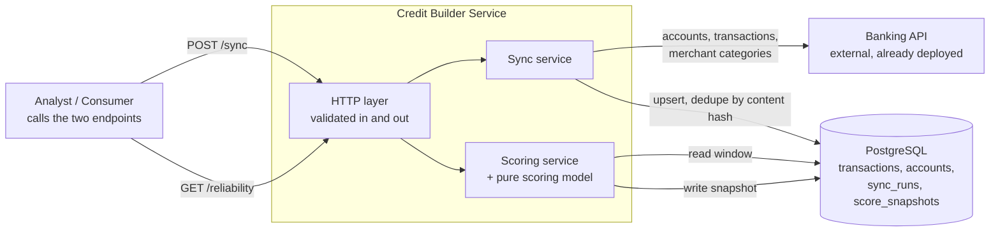
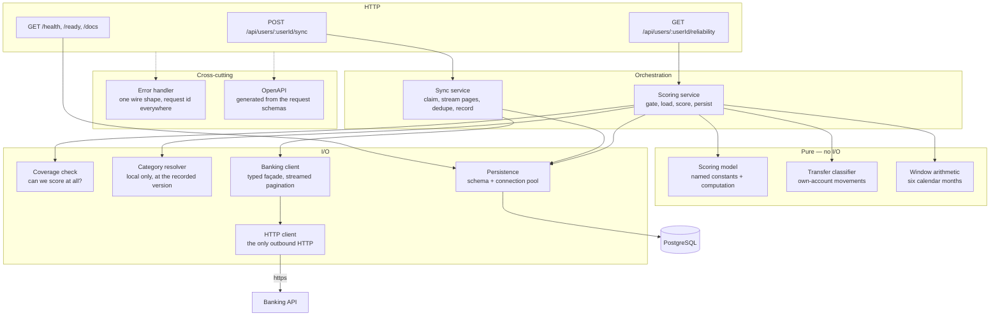
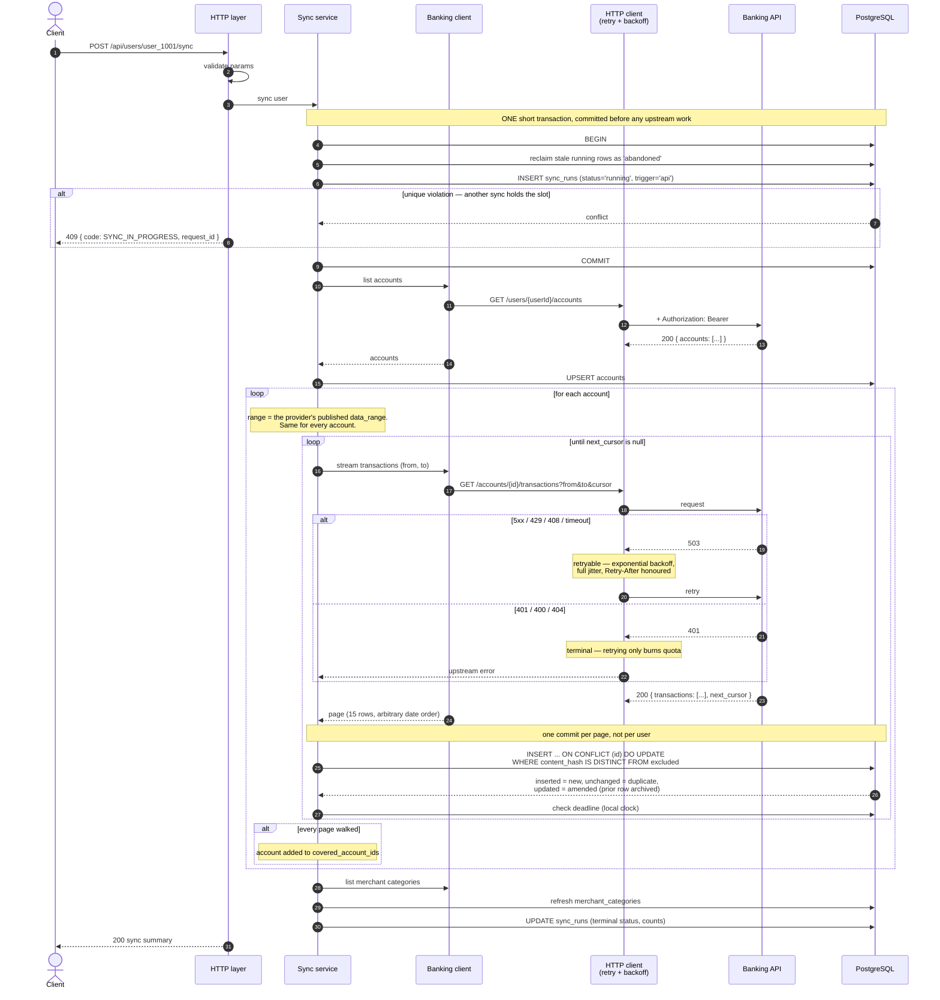
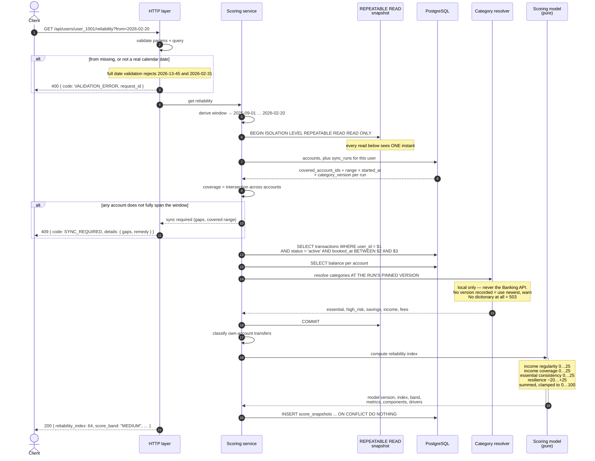

# Architecture and Design: Thin-File Credit Builder

---

## 1. Summary and motivation

Traditional credit scoring needs a credit history. People who lack one — young,
recently arrived, previously unbanked — are **thin-file**, and a normal
scorecard has nothing to say about them.

This service scores them from six months of bank transactions instead: it syncs
a user's accounts and transactions from an external Banking API into local
storage, then computes an integer 0–100, a band, the component metrics, and a
plain-language explanation of the result.

A score can decide whether someone gets credit, so it must be **right,
explainable, and reproducible months later** — even though the data behind it
comes from an API that can be slow, incomplete, or wrong.

---

## 2. Goals and non-goals

**Goals**

- A score is never computed on data we cannot vouch for.
- Every served score is reproducible and explainable after the model changes.
- Upstream failure degrades freshness, not correctness.
- The model is auditable by a human: named constants, no magic numbers, reasons
  attached to every output.

**Non-goals**

- Microservices, a UI, ML, or multi-currency.
- Real-time or streaming ingestion. Sync is caller-triggered.
- Serving a score for a window the sync has not covered. We refuse instead.
- Being the system of record for transactions. The Banking API owns it.
- FX conversion. The service is EUR-only; foreign-currency rows are dropped at
  ingest and counted, never converted (§4.5).
- Tombstoning an account that disappears upstream. Currently fails _silently_
  rather than loudly.

---

## 3. Success metrics

| Property             | Measure                                                         | Target                                                                          |
| -------------------- | --------------------------------------------------------------- | ------------------------------------------------------------------------------- |
| **Correctness**      | Scores served on incomplete coverage                            | **0** — structurally impossible; the refusal counter is the visible counterpart |
| **Reproducibility**  | Snapshots whose stored inputs recompute to the same score       | 100%                                                                            |
| **Explainability**   | Served scores with a driver for every non-zero component        | 100%                                                                            |
| **Sync reliability** | Successful runs ÷ all runs                                      | > 99%                                                                           |
| **Scoring latency**  | p99, excluding sync                                             | < 200 ms                                                                        |
| **Fairness**         | How often each component scores zero, by data-visibility cohort | Investigated when the low/high ratio exceeds 2×                                 |

Correctness and accuracy matter the most. A service that is fast and available
while handing out scores computed from a partial history has failed at the only
thing it exists to do.

**On the fairness metric.** A component scoring zero is ambiguous — the
applicant had no income, or we could not see it. The metric counts how often
each component scores zero, comparing users whose finances are largely visible
to us against those whose are not. How the cohorts are built, a worked example,
and why the threshold is a ratio are in
[scoring-model.md](scoring-model.md#bias-and-fairness).

---

## 4. Architecture

### 4.1 Context

The service scores from a **local mirror**, not from live Banking API calls.
Sync API pulls accounts and transactions into Postgres; scoring reads local data
only, never calls the Banking API at all, and never triggers a sync
itself.

Scoring is then one indexed range scan, an upstream outage costs freshness
rather than availability, and the inputs survive so a past score can be
reproduced.

> **Alternative: live pass-through.** Always fresh, but the inputs are discarded
> so nothing is auditable, and every credit decision inherits someone else's
> uptime.



The trade-off: a score is only as good as the last sync. So before scoring we
check that the data actually covers the window, rather than assuming it does
(§4.5).

### 4.2 API design

**`POST /api/users/{userId}/sync`**

| Status | Meaning                                                                                                                   |
| ------ | ------------------------------------------------------------------------------------------------------------------------- |
| `200`  | Summary: accounts, new / duplicate / amended counts, requested range, status (`succeeded` \| `partial`), run id, warnings |
| `404`  | `USER_NOT_FOUND` upstream                                                                                                 |
| `409`  | `SYNC_IN_PROGRESS` — one sync per user at a time                                                                          |
| `502`  | `UPSTREAM_UNAVAILABLE`                                                                                                    |

The endpoint takes no query parameters: how far back to look is discovered from
the provider's published `data_range` (§4.5).

**`GET /api/users/{userId}/reliability?from=YYYY-MM-DD`**

| Status | Meaning                                                                 |
| ------ | ----------------------------------------------------------------------- |
| `200`  | Score, band, metrics, drivers, data quality, model version              |
| `400`  | `VALIDATION_ERROR` — `from` missing or not a real calendar date         |
| `409`  | `SYNC_REQUIRED` — coverage incomplete; details name the gap per account |
| `503`  | `CATEGORIES_UNAVAILABLE` — no category dictionary has ever been fetched |

Every error shares one shape, always with a request id:

```json
{ "error": { "code": "SYNC_REQUIRED", "message": "…", "details": {}, "request_id": "req-7" } }
```

Response stability is layered deliberately: `reliability_index` and `score_band`
are the contract; `metrics` and `data_quality` are additive-only; `drivers` is
human-readable and explicitly unstable — never parse it.

The OpenAPI 3.1 document is generated from the same schemas that validate at
runtime, so it cannot drift. Served at `/openapi.yaml` and `/openapi.json`, and
browsable at `/docs`.

### 4.3 Component design



The layering rule: **routes know HTTP, services know the workflow, the scoring
model knows the model, and only the persistence layer knows SQL.**

Three properties hold this together:

- **The scoring model and transfer classifier are pure.** No database, no clock,
  no network — everything they need is passed in. This is what makes a score
  reproducible from a stored snapshot.
- **Dependencies are injected**, so tests build the app with stubs and no module
  state to reset.
- **All outbound HTTP funnels through one client**, enforced by a lint rule
  blocking direct `fetch`, so no call site ships without timeouts and retry.

### 4.4 Data model

| Table                        | Purpose                                                                                                                                                                                      |
| ---------------------------- | -------------------------------------------------------------------------------------------------------------------------------------------------------------------------------------------- |
| `accounts`                   | Local mirror of upstream accounts, with the latest reported balance.                                                                                                                         |
| `transactions`               | The mirror. PK is the **upstream id**, so dedupe is a primary-key conflict. Carries `content_hash`, `revision`, `status` (`active` \| `amended` \| `reversed`). Scoring reads `active` only. |
| `transaction_revisions`      | Append-only history of amendments — what we previously believed, so an old score stays reproducible.                                                                                         |
| `sync_runs`                  | One immutable row per attempt: range requested, `covered_account_ids`, `category_version`, trigger, start time, counts, terminal status.                                                     |
| `merchant_category_versions` | One row per distinct dictionary the service has seen, with its content hash. A refresh that changes nothing mints nothing.                                                                   |
| `merchant_categories`        | The entries of each version, keyed `(version, code)`. `group` drives every scoring semantic; nothing hardcodes category membership.                                                          |
| `score_snapshots`            | Immutable record of every served score: window, the version pointers, `closing_balances`, `input_hash`, metrics, components, drivers, data conditions, and the run it scored against.        |

No table stores a raw upstream payload. Keeping one would be a hedge against
needing a field we had not mapped — but every sync re-fetches the provider's
whole range (§4.5), so anything unmapped is one sync away. The hedge would pay
storage it could never earn back.

Money is `numeric(14,2)` and a string in transit — never a float. Dates are plain
`YYYY-MM-DD` in UTC; a booking date has no timezone, and giving it one creates
month-boundary bugs.

**Upstream transactions are treated as mutable.** A primary-key conflict is
resolved by comparing `content_hash`, on a difference the prior row
is archived, `revision` increments, and the row updates. The `status` column
carries `amended` and `reversed` and scoring filters on `active`, but **nothing
writes a non-`active` status today** — this provider exposes no reversal signal,
so the mechanism is in place and unpopulated. Banks amend routinely — authorisations
settle at a different amount, categories are corrected, payments reversed,
booking dates shift across a month boundary — and each changes a score while
raising no error.

**`sync_runs` is the only sync bookkeeping.** Coverage is answered by asking
which runs covered which accounts. No per-account state is kept, because every
run re-walks the same range for every account (§4.5), so per-account rows would
hold identical values after a success.

**`score_snapshots` is an audit record, not a cache.** Auditing means showing
the answer follows from the inputs, not just recording it, so a row stores what
is needed to re-derive the score rather than a copy of everything that produced
it — pointers where a pointer suffices, and a copy only where nothing survives
to point at.

| Input        | How it is recovered                                                                                                                                                                                                            |
| ------------ | ------------------------------------------------------------------------------------------------------------------------------------------------------------------------------------------------------------------------------ |
| Transactions | Rebuilt as of the scoring time: `ingested_at` excludes later arrivals and `transaction_revisions` rolls back amendments, including one that moved a booking date out of the window. `input_hash` verifies the rebuild.         |
| Model        | `model_version` names a file in `models/`, kept forever and never edited.                                                                                                                                                      |
| Categories   | `category_version` names a row in `merchant_category_versions`; a refresh that changes anything mints a new version and keeps the old.                                                                                         |
| Balances     | Stored on the snapshot as `closing_balances`. Unlike the others it cannot be pointed at, because `accounts.current_balance` is overwritten by every sync and the provider does not reconcile it against the rows it publishes. |

The two version schemes are enforced, not trusted: a released model's source is
hashed and `tests/unit/model-versions.test.ts` fails the build on any edit, and a
dictionary version is immutable by construction because a change writes a new row
instead of updating one.

Both rest on the same assumption — **every version that ever served a score
survives**. Delete `models/v1.ts` or a `merchant_category_versions` row and the
snapshots pointing at it become unexplainable, which is why a lookup throws
rather than falling back to the current version.

The unique index on `(user_id, window_end, model_version, input_hash)` is a
de-duplication key: different inputs or a different model record a new row
beside the old one. `input_hash` therefore covers **both** model inputs, the
transactions and the balances. Hashing transactions alone would let a restated
balance score differently under an unchanged fingerprint — and because the
insert is `ON CONFLICT DO NOTHING`, the new score would be served while the
stored snapshot silently kept the old one.

### 4.5 Data consistency

**Every sync re-reads both halves in full — the account list and every
account's whole transaction range.** The account list always comes from the API,
never from the local mirror, and every mutable field is written back: a stale
account `type` would misclassify every transfer into that account.

The transaction bounds come from the Banking API's own unauthenticated discovery
endpoint, `GET /`:

```json
{ "data_range": { "from": "2025-09-01", "to": "2027-06-30" } }
```

So the range is discovered at run time — not configured, not chosen by the
caller. It is also the only bound available, since accounts carry no opened-at
date. Pagination cursors live inside a single walk and are never stored, and an
account whose walk does not finish is left out of `covered_account_ids`.

> **Alternative: resume incrementally**, from a stored cursor or a high-water
> mark plus a lateness buffer. The first silently skips and duplicates rows; the
> second never notices an amendment older than the buffer.

**Coverage — can we score at all?** Every account the user currently holds must
pass two checks:

1. **Range** — some completed run asked for a span covering the whole window.
2. **Timing** — that run _began_ no earlier than the window's last day.

Timing matters because the recorded range is what we asked the API for, and `to`
may be in the future. A run that began in January cannot have seen a February
transaction, whatever it requested.

Same day counts. Demanding strictly _after_ would make a window ending today
unscoreable on any day — the run would have to start tomorrow — so the obvious
"sync, then score as of today" could never succeed. The cost is that a sync at
09:00 misses what is booked later that day; that is one day, it is the day not
having finished rather than a gap of ours, and `data_quality` says so.

Coverage is the intersection across accounts, and it composes across runs: two
partial runs covering different accounts add up. The account list comes from the
accounts table, so a newly connected account appears in no run and shows up as a
gap.

Any shortfall — one day, one account — is `409 SYNC_REQUIRED` naming the gap.
There is no threshold: unfetched months look identical to months with no
activity, so partial data is not less certain, it is wrong in one direction, and
the applicant absorbs a gap that is ours.

> **Alternative: score it and caveat it.** A caveat in a side field loses to the
> number beside it, and any threshold below 100% is arbitrary.

**Concurrency.**

| Path    | Guarantee                                                             | Mechanism                                                                                                                                                                                                                                                                                 |
| ------- | --------------------------------------------------------------------- | ----------------------------------------------------------------------------------------------------------------------------------------------------------------------------------------------------------------------------------------------------------------------------------------- |
| Sync    | One per user at a time                                                | Claiming `INSERT` under `UNIQUE (user_id) WHERE status = 'running'`. A unique violation means someone else won → `409` in ~1 ms.                                                                                                                                                          |
| Sync    | A crash cannot wedge a user, and a sick upstream cannot hold the slot | A 10 min deadline, enforced from both sides. The run checks it at every page boundary and aborts, keeping what committed and reporting `partial`. The next claim reclaims any `running` row older than the deadline plus a minute of grace. A run that _throws_ goes to `failed` at once. |
| Scoring | No read skew                                                          | All reads in one `REPEATABLE READ, READ ONLY` transaction, so a concurrent sync cannot produce a score assembled from two instants.                                                                                                                                                       |
| Scoring | No lock                                                               | Scoring is idempotent and the model pure; concurrent identical requests collapse to one snapshot via `ON CONFLICT DO NOTHING`.                                                                                                                                                            |

The claim transaction must stay **short** — it commits before any upstream work.
Held open across the sync, a competitor's `INSERT` would block on the
uncommitted key instead of failing fast.

Reclaiming on elapsed time alone would be a guess: sync duration is set by
upstream latency, not data volume, so a single slow page can push an ordinary
sync past any deadline chosen from the happy path. Having the run enforce the
**same** deadline on itself removes the guess — a live run always stops before
the reclaim window opens, so a reclaimable row has no live owner. Aborting is
also right on its own terms: an upstream that slow should be backed away from,
and nothing is lost, since every run re-reads the whole range anyway.

**Database timeouts.** A pool's connection timeout bounds only _acquiring_ a
connection, so every connection also sets `statement_timeout` (15 s),
`lock_timeout` (5 s) and `idle_in_transaction_session_timeout` (30 s) —
otherwise one runaway query holds a connection forever. Two consequences:
migrations opt out of `statement_timeout`, since an index build is legitimately
long; and a claim that loses on `lock_timeout` (`55P03`) means what a unique
violation means, so both map to `409`. These bound statements and sessions —
a wedged claim is a _committed row_, which no timeout can reach, which is why
reclamation is not redundant.

Retries are deliberately _not_ layered on top: a failing local query is usually
a real defect, and retrying turns a fast error into a slow one.

> **Alternative to the unique index: `INSERT ... WHERE NOT EXISTS`.** One
> statement, but not atomic — the `WHERE NOT EXISTS` reads the transaction's MVCC
> snapshot and cannot see a concurrent uncommitted row, so both claimants insert.

**Drift.** The Banking API exposes no total or `has_more`, so count-based
reconciliation is unavailable. Drift is detected by the full re-read diffing
content hashes. Deletions are detectable in principle — present locally, absent
from a completed re-walk — but not implemented.

### 4.6 Failure modes and retry

| Response                  | Action                                                     |
| ------------------------- | ---------------------------------------------------------- |
| 5xx, 408, 425             | Retry — exponential backoff with **full jitter**           |
| 429                       | Retry, honouring `Retry-After` when present                |
| Transport error / timeout | Retry                                                      |
| 401, 403, 400, 404, 422   | **Terminal.** Retrying a bad key only burns the rate limit |

**Partial syncs.** Writes commit **per page**, so a crash on page 40 keeps pages
1–39. The unfinished account is not listed as covered; its rows stay and dedupe
next time.

**Sync/scoring edge cases**, the ones worth knowing:

| Case                                           | Behaviour                                                                                                                                                                                                                                                                                                    |
| ---------------------------------------------- | ------------------------------------------------------------------------------------------------------------------------------------------------------------------------------------------------------------------------------------------------------------------------------------------------------------ |
| Never synced, or last sync partial             | `409 SYNC_REQUIRED`. Never 0/LOW — absence of data is not evidence of unreliability.                                                                                                                                                                                                                         |
| Sync in flight while scoring                   | Served from committed data if that already covers the window; never waited for.                                                                                                                                                                                                                              |
| Backdated transaction after a score was served | The old snapshot stays valid for what it saw; a new score has a different `input_hash`. That is the audit trail working.                                                                                                                                                                                     |
| Banking API down during scoring                | Non-event. Scoring makes no outbound call at all: categories are read locally at the version the covering sync recorded, or the newest stored if it recorded none.                                                                                                                                           |
| `from` in the future                           | Accepted; coverage will not extend that far, so it refuses.                                                                                                                                                                                                                                                  |
| Own-account transfer                           | Reclassified by account type and category group: into savings is saving, out of savings is dis-saving, same-type is ignored. Never income **where the data identifies it**. A transfer from the user's own account at another bank does not, and counts as income; see [scoring-model.md](scoring-model.md). |
| Non-EUR account or transaction                 | Dropped at ingest, counted on `sync.non_eur_skipped` and reported in the sync `warnings`. The account's EUR history is still scored; a non-EUR account is dropped whole, because its balance would otherwise anchor the reconstruction.                                                                      |
| Account removed upstream                       | **Not handled** — see non-goals.                                                                                                                                                                                                                                                                             |

### 4.7 Observability

OpenTelemetry for traces, metrics and logs, so the collector decides where data
lands. Opt-in: with no exporter endpoint configured, the SDK never starts.

**Traces** come from automatic instrumentation on the three boundaries that
cost time: the inbound request, each Banking API call, and each database query.
That is enough to see where a request went and how long each hop took. There are
no hand-written spans — a decision recorded as a span attribute would be a
second place to keep in sync with the code, and the decisions that matter
already surface as metrics and as `data_quality` on the response.

**Metrics** answer two different questions.

_Is the service healthy?_ Request duration and error rate, database timings,
`banking.requests` and `banking.retries`, and the volume through each path —
`sync.duration`, `sync.transactions`, `scoring.duration`, `scoring.scores`,
`scoring.transfers_excluded`. Mostly automatic.

_Is the service correct?_ A service can be fast, available and error-free while
quietly refusing every score because sync has been failing. So:

| Metric                                                    | What it is the only way to see                                                                                                                     |
| --------------------------------------------------------- | -------------------------------------------------------------------------------------------------------------------------------------------------- |
| `scoring.refusals`                                        | Scores we could not serve, and why — sync lag, missing backfill, or a user who has never synced.                                                   |
| `scoring.reliability_index`                               | The spread of scores. A shift in the mix catches both a bad model deploy and a silent upstream recategorisation, neither of which raises an error. |
| `sync.amendments`                                         | Upstream rewriting transactions we already stored — the assumption the whole dedupe strategy rests on.                                             |
| `scoring.component_zeros`                                 | A component scoring zero far more often for thin-file users, which means we are measuring what we can see rather than how reliable someone is.     |
| `sync.runs`, `sync.conflicts`, `sync.reclaims`            | Sync outcomes, contention, and runs abandoned by a process that died.                                                                              |
| `sync.account_failures`, `sync.category_refresh_failures` | An account failing every night, or a dictionary feed that has started failing — both previously invisible, counted only inside one run's response. |
| `scoring.coverage_shortfall`                              | How far short we were — an hour behind reads very differently from never fetched.                                                                  |
| `scoring.category_dictionary.age`                         | Staleness of the list behind every essential/high-risk decision.                                                                                   |

**Logs.** Structured JSON, request id on every line and every error response.

**Alerting** is not configured here. It should be, on drift in both families:
the system metrics for availability and latency, and the business metrics
for correctness.

### 4.8 Request flows

#### Sync — `POST /api/users/{userId}/sync`



If the walk throws on page 40, pages 1–39 stay committed; the run becomes
`partial` and that account is left out of `covered_account_ids`. If the process
dies outright it cannot mark itself failed, so the row stays `running` until the
next claim reclaims it once `started_at` is past the deadline plus grace.

#### Scoring — `GET /api/users/{userId}/reliability?from=YYYY-MM-DD`



Two orderings are deliberate. **Coverage is checked first**, before a single
transaction is loaded — so there is nothing half-built to throw away. **The read snapshot
closes before the model runs**, because the model needs no database.

---

## 5. Testing strategy

Four tiers, separated by **what they need to run** and **what they can prove**.

| Tier          | Needs                                   | Owns                                                                                                          | Runs              |
| ------------- | --------------------------------------- | ------------------------------------------------------------------------------------------------------------- | ----------------- |
| `unit`        | Nothing — no I/O                        | Scoring model, window arithmetic, transfer classification, pagination hazards                                 | PR gate, manual   |
| `integration` | Exactly **one** real dependency         | The database: dedupe and revisions, coverage queries, sync claiming, read isolation                           | PR gate, manual   |
| `e2e`         | Whole app + Postgres + fake Banking API | Properties spanning layers: sync → score → audit, reproducibility, partial-sync recovery, concurrent requests | PR gate, manual   |
| `contract`    | The **live** Banking API                | That our assumptions about upstream still hold                                                                | Scheduled, manual |

---

## 6. Technology choices

Prefer boring, prefer one source of truth, prefer failing at build time rather
than at 3am.

| Choice                | Why                                                                                                                                                             | Trade-off                                                                                     |
| --------------------- | --------------------------------------------------------------------------------------------------------------------------------------------------------------- | --------------------------------------------------------------------------------------------- |
| **Fastify**           | One schema validates the request, serialises the response and generates the OpenAPI document, so docs cannot drift from behaviour.                              | Express would make that four hand-wired libraries. Fastify's ecosystem is smaller.            |
| **Zod**               | The same schema gives a runtime validator and a static type, so they cannot disagree. Zod 4 emits JSON Schema, which is what makes the OpenAPI generation work. | TypeBox is faster; Zod's transforms suit messy upstream payloads.                             |
| **PostgreSQL**        | Exact decimal money, and real constraints — dedupe and sync claiming both rely on the database enforcing uniqueness under concurrency.                          | SQLite needs no server and would be fine for one user, but not for 100k.                      |
| **Drizzle**           | Queries read like SQL, so what runs is what was written, and migrations are committed `.sql` that CI applies byte-identical.                                    | Prisma has better tooling, but its emitted SQL is not obvious. Smaller community.             |
| **undici**            | Node's actual HTTP stack, so we get connection pooling, per-phase timeouts and a mock dispatcher for deterministic tests.                                       | Retry and backoff are hand-written — deliberately, since the classification is worth reading. |
| **Vitest**            | Native ESM and TypeScript with no transform config; projects separate "no infrastructure" from "needs a database".                                              | A bundler in the test path that production does not use; a CI job smoke-tests the real build. |
| **ESLint + Prettier** | Prettier ends formatting arguments. ESLint owns correctness, including the type-aware rule that blocks bare `fetch`.                                            | Biome is far faster but has no type-aware linting, which is where the value is.               |
| **OpenTelemetry**     | One trace context across handler, Banking API call and database query, and vendor-neutral across all three pillars.                                             | Dependency weight, and the SDK must be preloaded before anything it instruments.              |

Two constraints worth knowing. **TypeScript is pinned to 6.0** because the
type-aware lint tooling still requires < 6.1 — installing 7 silently disables it.
And **Docker Desktop does not install on macOS 12**, so the README documents a
native Postgres path alongside `docker compose`.

## 7. Open questions

- How long should a score snapshot be kept? It is an audit record and personal
  financial data at the same time, and erasure and retention pull opposite ways.
- At what point should sync stop being a synchronous request and become a queued
  job? The run record is already shaped like a job record.
- Are the model's weights defensible? They are a reasoned starting hypothesis,
  not calibrated against real repayment outcomes — so for now the score should
  inform a human decision rather than make one.
